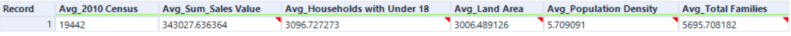

# Pawdacity_a-leading-pet-store-chain-in-Wyoming
To create a dataset (Data Analysis)

Project 2.1: Data Cleanup

# Step 1: Business and Data Understanding

## Key Decisions:

### 1.	What decisions needs to be made?

Well, From the available data we need to provide information to the decision maker in Pawdacity (a leading pet store chain in Wyoming). The analysis is to recommend the city for Pawdacity’s newest store, based on predicted yearly sales.

### 2.	What data is needed to inform those decisions?

Because the monthly sales represent the year of 2010, the following data are needed:

1-	City – The available city that Pawdacity chain works in.
2-	2010 Census Population
3-	Total Pawdacity Sales for 2010 – Aggregated from the monthly sales.
4-	Household with under 18 - 
5-	Land Area
6-	Population Density
7-	Total Families

# Step 2: Building the Training Set

Column|	Sum|	Average
| --- | --- | --- |
Census Population|	213,862|	19,442
| --- | --- | --- |
Total Pawdacity Sales|	3,773,304|	343,028
| --- | --- | --- |
Households with Under 18|	34,064|	3,097
| --- | --- | --- |
Land Area|	33,071|	3,006
| --- | --- | --- |
Population Density|	63|	5.7
| --- | --- | --- |
Total Families|	62,653|	5,696
| --- | --- | --- |

Note: Screen shot for the result (By Alteryx): check the workflow

 
# Step 3: Dealing with Outliers

## A-	Charts To help deciding what outlier to remove:

### 1-	I will show below the scatter plots for all predictors (By Alteryx):

 	 
 	 check the workflow
 	

### 2-	I will provide information about (IQR, Upper Fence, and Lower Fence) by Excel:

Field | Q1 | Q3	| IQR	| Upper fence	| Lower fence
| --- | --- | --- | --- | --- | --- |
2010 Census	| 7,917.00 | 26,061.50 | 18,144.50 | 53,278.25 | (19,299.75)
| --- | --- | --- | --- | --- | --- |
Land Area | 1,861.72 | 3,504.91 | 1,643.19 | 5,969.69 | (603.06)
| --- | --- | --- | --- | --- | --- |
Households with Under 18	| 1,327.00 | 4,037.00 | 2,710.00 | 8,102.00 | (2,738.00)
| --- | --- | --- | --- | --- | --- |
Population Density | 1.72 | 7.39 | 5.67 | 15.90 | (6.79)
| --- | --- | --- | --- | --- | --- |
Total Families | 2,923.41 | 7,380.81 | 4,457.40 | 14,066.90 | (3,762.68)
| --- | --- | --- | --- | --- | --- |
Total Sales Value | 226,152.00 | 312,984.00 | 86,832.00 | 443,232.00 | 95,904.00 
| --- | --- | --- | --- | --- | --- |

### 3-	Histogram For all the predictors (By Alteryx):

 

### 4-	Summary of the final Dataset (By Alteryx):

 

### 5-	Cities that are outliers (Above the upper Fence):

Cheyenne - 2010 Census
Rock Springs - Land Area
Cheyenne - Population Density
Cheyenne - Total Families
Gillette and Cheyenne - Total Sales Value

## B-	Analysis and Decision:

From A.5 Cities that are outliers (Above the upper Fence), I need to decide among them which city the dataset analysis will allow me to remove. The cities are:

-	Cheyenne.
-	Rock Springs.
-	Gillette.

### Cheyenne:

Considered outlier in total sales, total families, population density, and census of 2010.
And that reasonable to be outlier but I cannot remove it because the correlation between the three factors is very high. Please see the following image:

 

### Rock Springs:

It is a city considered outlier in the Land Area. Its situation will affect the decision that management will make. Because it matches the request of the management about the city that needs to put two more stores in it. The sales in the city almost the average among all the cities. 

### Gillette:

The sales value is very high, but the Land Area is below the average. So, this information cannot be explained. Gillette will be the outlier I can remove. It is not like the case of Cheyenne and not the same case of Rock Springs, the main reason to remove this city, as follow:

-	Its case to be an outlier cannot be explained and need more investigation.
-	No need to increase the number of the stores.
-	The sales value does not match with the correlation table.

## C-	 Workflow (By Alteryx):

Check_workflow
 
## D-	Tools I used in Alteryx:

 
check workflow

